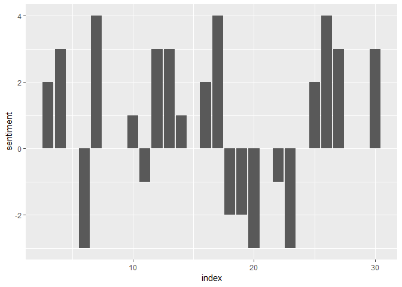
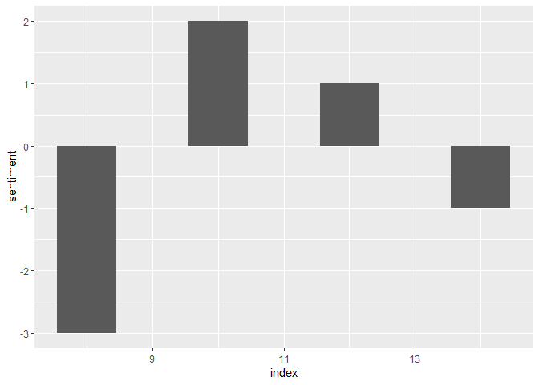
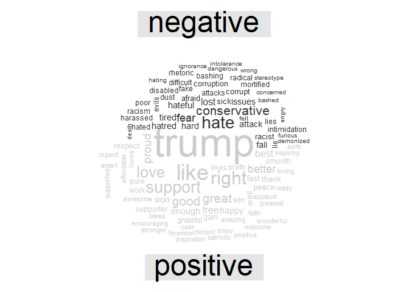
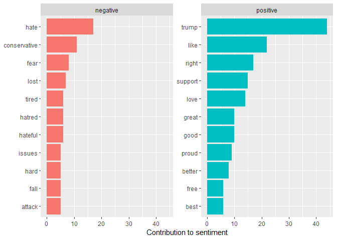

WalkAway Narratives
================
Nicolas Restrepo
March 15, 2019

Sentiment Analysis
------------------

``` r
library(tidyverse)
```

    ## -- Attaching packages --------------------------------------------------------------------------------------------------------------------------------------- tidyverse 1.2.1 --

    ## v ggplot2 3.1.0       v purrr   0.2.5  
    ## v tibble  2.0.1       v dplyr   0.8.0.1
    ## v tidyr   0.8.2       v stringr 1.3.1  
    ## v readr   1.3.1       v forcats 0.3.0

    ## -- Conflicts ------------------------------------------------------------------------------------------------------------------------------------------ tidyverse_conflicts() --
    ## x dplyr::filter() masks stats::filter()
    ## x dplyr::lag()    masks stats::lag()

``` r
library(tidytext)
library(janeaustenr)
library(stringr)
library(wordcloud)
```

    ## Loading required package: RColorBrewer

``` r
library(reshape2)
```

    ## 
    ## Attaching package: 'reshape2'

    ## The following object is masked from 'package:tidyr':
    ## 
    ##     smiths

``` r
library(stringi)
library(readxl)
```

Import the data-set

``` r
walkaway_narratives <- read_excel("walkaway_narratives.xlsx")
```

I am going to create new data-sets broken down by individual words. I'm sure there are more efficient ways of doing this.

``` r
wordsify <- function(x) {
  
words_x <- walkaway_narratives[x,] 

data.frame(word = unlist(stri_extract_all_words(stri_trans_tolower(words_x$Text))), 
                      title = walkaway_narratives[x,1])
}

list_corpus <- map(1:27, wordsify)

corpus <- bind_rows(list_corpus)
```

Now we have a data-set where every word on each narrative is its own row and we have the appropriate accompanying title. Now, we can provide line numbers so we can identify how the narrative develops

``` r
tidy_narratives <- corpus %>% 
  group_by(Title) %>% 
  mutate(linenumber = row_number()) %>% 
  ungroup() 
```

See how sentiment evolves throughout the narratives

``` r
wa_sentiment <- tidy_narratives %>% 
  inner_join(get_sentiments("afinn")) %>% 
  group_by(Title, index = linenumber %/% 10) %>% 
  summarise(sentiment = sum(score)) %>% 
  mutate(method = "AFINN")
```

    ## Joining, by = "word"

``` r
# Plot the narratives 

wa_sentiment %>% 
  filter(Title == "Andrea's #WalkAway") %>% 
  ggplot(aes(index, sentiment)) + 
  geom_col(show.legend = F)
```



``` r
wa_sentiment %>% 
  filter(Title == "Trace & Gary's #WalkAway") %>% 
  ggplot(aes(index, sentiment)) + 
  geom_col(show.legend = F)
```



The narratives aren't too long but this can potentially be very useful.

Maybe we could explore creating some wordclouds

``` r
tidy_narratives %>% 
  inner_join(get_sentiments("bing")) %>% 
  count(word, sentiment, sort = T) %>% 
  acast(word ~ sentiment, value.var = "n", fill = 0) %>% 
  comparison.cloud(colors = c("gray20", "gray80"), 
                   max.words = 100)
```

    ## Joining, by = "word"



Look at that! Conservative is negative and Trump is positive, bang in the middle.

What are the most common positive and negative words?

``` r
bing_words_counts <- tidy_narratives %>% 
  inner_join(get_sentiments("bing")) %>% 
  count(word, sentiment, sort = T) %>% 
  ungroup()
```

    ## Joining, by = "word"

``` r
bing_words_counts
```

    ## # A tibble: 390 x 3
    ##    word         sentiment     n
    ##    <chr>        <chr>     <int>
    ##  1 trump        positive     44
    ##  2 like         positive     22
    ##  3 hate         negative     17
    ##  4 right        positive     17
    ##  5 support      positive     15
    ##  6 love         positive     14
    ##  7 conservative negative     11
    ##  8 good         positive     10
    ##  9 great        positive     10
    ## 10 proud        positive      9
    ## # ... with 380 more rows

``` r
# Plot these word counts 

bing_words_counts %>% 
  group_by(sentiment) %>% 
  top_n(10) %>% 
  ungroup() %>% 
  mutate(word = reorder(word, n)) %>% 
  ggplot(aes(word, n, fill = sentiment)) + 
  geom_col(show.legend = F) + 
  facet_wrap(~sentiment, scales = "free_y") + 
  labs(y = "Contribution to sentiment", 
       x = NULL) + 
  coord_flip()
```

    ## Selecting by n



This is not the most insightful but the code might be interesting. Also, it's very interesting how central Trump is to everything.
